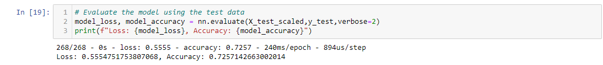
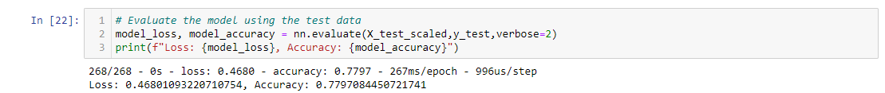

# Neural Network Charity Analysis
## Overview
The purpose of this analysis was to generate a model to accurately assess where investments should be made.

## Results
### Data Preprocessing
- Variables considered targets

    - Is_Successful column (indicates money was used successfully)

- Variables considered features

    - Application_Type, Affiliation, Classification, Use_Case, Organization, Status, Income_Amt, Special_Considerations, Ask_Amt, Is_Successful

    - Name was also a feature for the 3rd Optimization attempt

- What variables were removed

    - EIN and Name for the initial build and for optimization attempts 1 and 2

    - EIN only for Optimization attempt 3

### Compiling, Training, and Evaluation the Model
-  Neurons, Layers, and Activation Functions
    - Input Layer had the length of x_train (number of features)
    - Hidden Layer 1 had 80 neurons with a relu Activation Function
    - Hidden Layer 2 had 30 neurons  with a relu Activation Function
    - Output Layer used a sigmoid Activation Function

-   Activation function for hidden layers chosen was relu due to it being ideal for nonlinear input data
    - Sigmoid chosen for Output Layer as it is ideal for binary classification
    - Layer 1 neurons was determined to be 80, or roughly twice the input features
    - Layer 2 neurons w determine to be 40, or roughly 1 times the input features bringing the total to 3 times the input features

### Model performance
-   Initial performance was 72.6%

-   Model performance after optimization was 78% 

-   Steps to increase performance

    - First attempt: added a third hidden layer increased number of epochs to 150
    - Second attempt: dropped columns AFFILIATION and ORGANIZATION and set number of epochs to 150
    - Third attempt: retained the NAME column and separated into buckets using less than 10 as the criteria for Other

## Summary
-   While an above 75% accuracy was achieved, it is not recommended to use that particular incarnation as dropping the NAME column could skew the model. If a name repaeats often, the applicant is likely a well established and reliable entity which isn't the case for all applicants.

-   A recommendation for an alternative methodology would be the use of a Random Forest Classifier as it excels at handling outliers as well as nonlinear data. The weak learner algorithms utilized in the Random Forest Classifier combine their output when making a final classification. This can be a very powerful methodology.
